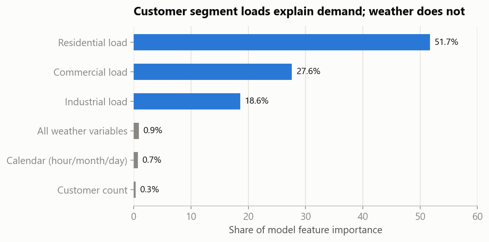
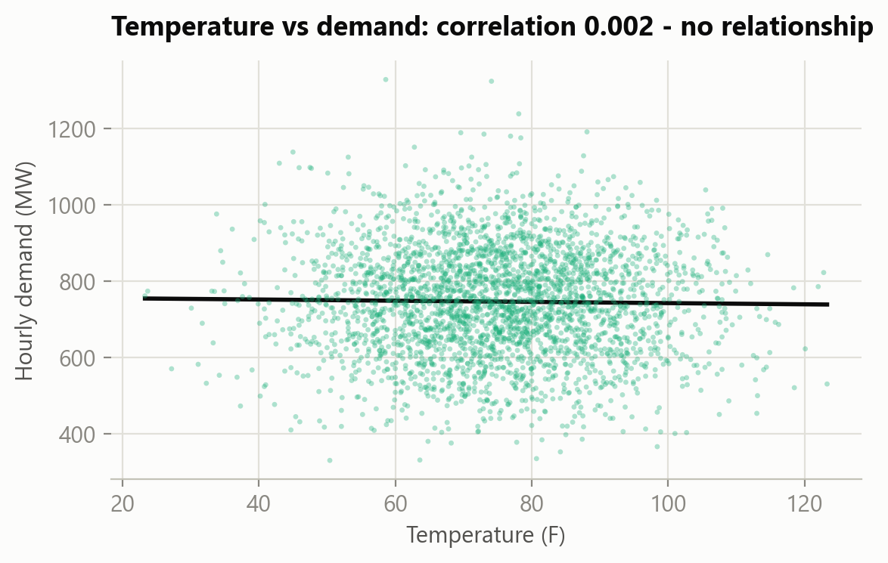
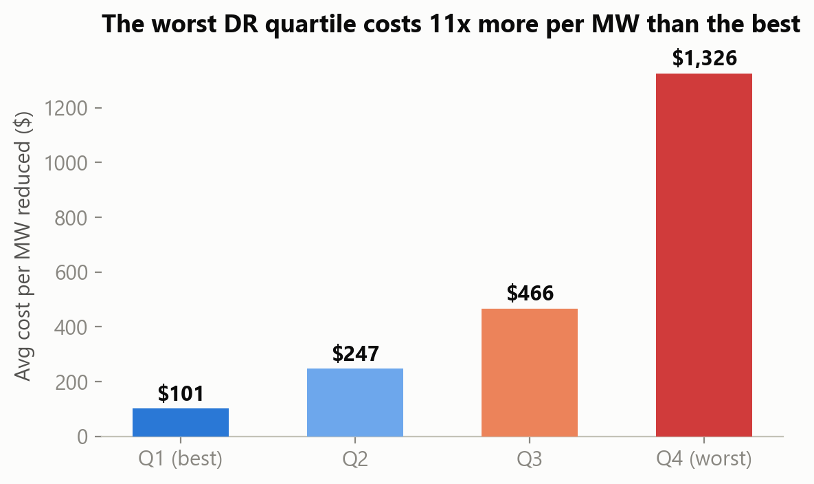
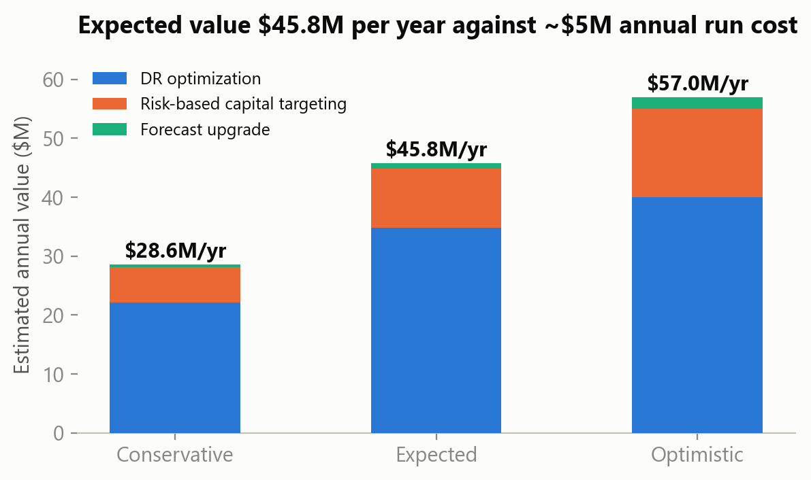

# ⚡ NGES Grid Analytics — Demand Forecasting, Infrastructure Risk & Demand Response ROI

An end-to-end data science consulting project for a (simulated) regional electric utility,
**NorthGrid Energy Services (NGES)**: 3.8M customers, five states, and peak demand events that
grew from 14 in 2022 to 34 in 2025 with an estimated **$95–120M of financial exposure**.

I analyzed three years of hourly demand data, 500 substations, and 8,000 demand response events
to answer one question: *why is demand volatility rising, and what should the utility do about it?*

**🔗 Live dashboard:** _deploying on Streamlit Community Cloud — link coming shortly_

## Headline findings

| # | Finding | Evidence |
|---|---------|----------|
| 1 | **Weather is not the driver.** The client's leading theory fails: temperature–demand correlation is **0.002**, and peak events occur at the same 10% rate in every temperature band. | 25,000 hourly records |
| 2 | **Customer segment loads are the driver.** Demand tracks the sum of residential + commercial + industrial loads at **0.984** correlation. Spikes happen when segments peak together. | Segment share of model signal: ~99% |
| 3 | **A simple model beats the incumbent forecast by 17%.** A fully explainable linear model on segment loads scores **19.9 MW MAE vs 24.0 MW** for the utility's forecast (time-based hold-out). A random forest adds nothing. | R² 0.969, MAPE 3.3% → ~2.8% |
| 4 | **Peak events become predictable.** Peaks are simply the top decile of demand (≥ ~929 MW), so the forecast doubles as an early-warning system: **88.6% precision / 86% recall**. | Hold-out 2025 window |
| 5 | **Grid risk is concentrated.** **31 of 500 substations** are critical (age is the strongest driver, r = 0.52); **35 already run past 100%** of rated capacity. | Two regions hold ~60% of critical assets |
| 6 | **$98.5M is recoverable from demand response execution alone.** The worst quartile of events costs **11×** more per MW than the best and absorbed $141M of the $420M program for 10% of results — with identical performance across customer types, it's an execution problem, not a recruitment problem. | 8,000 DR events |

**Bottom line:** three recommendations worth an expected **$45.8M/yr** (conservative $28.6M,
optimistic $57.0M) against ~$8M one-time + $5M/yr to run — payback in under a year.

## Sample visuals

| | |
|---|---|
|  |  |
|  |  |

## Repository structure

```
├── app.py                  # Interactive Streamlit dashboard (KPIs + 4 analysis tabs)
├── data/                   # Three source datasets + data dictionary (simulated utility data)
├── analysis/               # R Markdown reports (knit-ready)
│   ├── NGES_Day1_EDA_Report.Rmd              # Data quality + exploratory analysis
│   └── NGES_Day2_Modeling_Risk_ROI_Report.Rmd # Models, risk tiers, DR savings, ROI
├── scripts/
│   └── build_charts_and_extracts.py          # Rebuilds figures/ and dashboard/ from data/
├── figures/                # Publication-ready charts (matplotlib)
├── dashboard/              # Aggregated CSV extracts (BI-tool ready)
└── presentation/           # Executive board deck (16 slides, business-level)
```

## Run it

**Dashboard (Python):**
```bash
pip install -r requirements.txt
streamlit run app.py
```

**Analysis reports (R):** open either `.Rmd` in `analysis/` in RStudio and knit
(needs `tidyverse`, `scales`, `knitr`, `ranger`). Data paths resolve automatically.

**Rebuild figures & extracts:** `python scripts/build_charts_and_extracts.py`

## Method notes

- **Honest evaluation:** models are scored on a *time-based* hold-out (most recent 20% of hours),
  never a random split, and benchmarked against the client's own forecast on the identical window.
- **Model selection favors explainability:** the linear model wins on accuracy *and* interpretability —
  the right answer for a regulated utility that must defend planning methods publicly.
- **Every dollar figure has visible assumptions:** 2.83-year annualization, 7–8% cost of capital on
  deferrals, $100–200/MWh emergency premiums, DR savings priced at the program's own median ($330/MW).
- **Limitations documented:** ~2% missing weather/forecast values (median-imputed), physically
  impossible humidity readings (sensor audit recommended), and a demand↔infrastructure join gap that
  keeps integration at regional level.

## Context

Built as the analytics core of a graduate data science consulting simulation (executive engagement
packet, three integrated datasets, board-level deliverable). All data is simulated / educational.

**Author:** Ujwal Dasari — [github.com/ujwaldasari1](https://github.com/ujwaldasari1)
